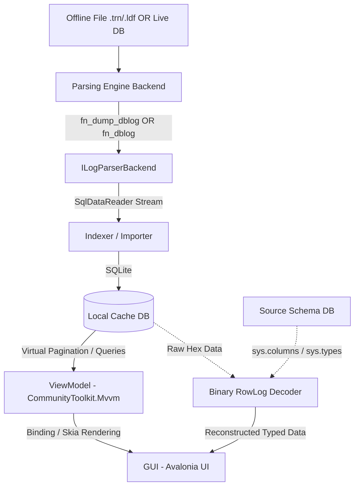
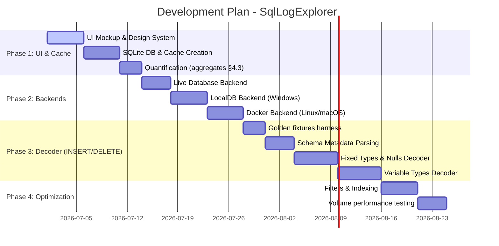

# Comprehensive Functional Specification: SqlLogExplorer

**SqlLogExplorer** is a high-performance, cross-platform graphical analyzer for SQL Server transaction logs (live databases, `.ldf`, and `.trn`), developed in C# 14 / .NET 10 with Avalonia UI.

---

## 1. Introduction and Objectives

### 1.1 Context
In SQL Server environments, analyzing the transaction log is essential for auditing changes, understanding the root cause of data corruption, or performing fine-grained incident recovery (log rescue).
The internal format of the transaction log is proprietary, complex, and not officially documented by Microsoft.

### 1.2 Application Objective
**SqlLogExplorer** enables Database Administrators (DBAs) and developers to:
* **Analyze the active log of a live database** via `sys.fn_dblog` to quickly investigate recent activity.
* **Load and analyze one or more offline transaction-log backup files** (`.trn`) via `sys.fn_dump_dblog` — a single backup or a **chain** covering a time window. *(MVP scope: `.trn` backups only — see the note on `.ldf` files below.)*

> **On `.ldf` files.** `sys.fn_dblog` and `sys.fn_dump_dblog` operate at the *database* level, not on an isolated file. A detached `.ldf` cannot be read on its own: the log belongs to a database and requires its `.mdf`. The realistic path is to *attach* (`.mdf` + `.ldf`) onto the throwaway instance and then run `fn_dblog`. Reading a raw `.ldf` directly is neither documented nor reliable, so it is **post-MVP** (see §7.5) and out of the initial offline scope.
* Visualize the stream of recorded operations (inserts, updates, deletes, transaction commits/rollbacks).
* **Quantify operations by type (`Operation`) and by object (`AllocUnitName`)** to get an aggregated overview of the activity (see §4.3 and §6.2).
* Quickly filter and search through millions of records.
* Decode the raw binary content of the rows (`RowLog Contents`) to reconstruct the typed values. **MVP Scope: full row images of `LOP_INSERT_ROWS` and `LOP_DELETE_ROWS` operations.** The before/after reconstruction of `UPDATE` (`LOP_MODIFY_ROW`, which logs a *delta* and not a complete row) is postponed to post-MVP (see §5).

### 1.3 Technological Positioning
* **Cross-platform**: Windows, macOS, and Linux via **Avalonia UI** (Skia graphics engine).
* **Performance**: Use of modern C# structures (`ReadOnlySpan<byte>`, `Memory<T>`), asynchronous streams, an intermediate local storage (SQLite), and a virtualized display.
* **Hybrid architecture**: Supports direct connections to live SQL Servers, as well as temporary internal SQL Server engines (LocalDB on Windows, Docker on Mac/Linux) to process offline files without cluttering the user's local SQL instances.

---

## 2. General Architecture & Data Flow

The application follows a decoupled architecture to maintain the fluidity of the graphical interface, even when processing large files.


*(Note: In Live Database mode, the "Source Schema DB" is the exact same database as the "Live DB" being parsed.)*

### 2.1 The Three Major Layers
1. **Parsing Layer (Backend)**: Communicates with a SQL Server instance (live or temporary) to extract raw records.
2. **Persistence and Cache Layer (Local DB)**: Temporarily stores the extracted records in an indexed local SQLite database. This prevents out-of-memory exceptions and minimizes lock times on live servers.
3. **Presentation Layer (Avalonia UI)**: Smoothly displays data via a virtual `DataGrid` connected to the local database.

---

## 3. Parsing Engines (Backends) and Provider Pattern

Depending on the user's chosen path (Live DB vs Offline File) and OS, the application relies on different implementations of the `ILogParserBackend` interface.

```csharp
public interface ILogParserBackend
{
    Task InitializeAsync(CancellationToken ct = default);

    // targets: one or more .trn paths (offline) OR a single connection string (live).
    // Live analysis may additionally narrow the read to an LSN range resolved from the
    // chosen date window (§3.1); that range parameter is introduced by the plan that
    // adds time-window filtering.
    IAsyncEnumerable<LogRecord> ParseLogAsync(IReadOnlyList<string> targets, CancellationToken ct = default);

    Task CleanupAsync(CancellationToken ct = default);
}
```

### 3.1 Path A: Live Database Analysis (Direct Connection)
The user connects to an active SQL Server through a **connection dialog** modeled on the SSMS / Azure Data Studio dialog (see `specs/01.connection.png`) and selects the target database. The dialog exposes: server name; authentication mode (Windows / SQL Server login); user name and password (with an optional "remember password"); **Encrypt** (Optional / Mandatory) and **Trust Server Certificate**; the target **database** dropdown (populated after connecting to the server); a recent-connections history; and an advanced **"Connection string" tab** for pasting a raw ADO.NET string.

> `fn_dblog` reads the log of the **selected database**, so a database must be chosen (not just a server).

> **"Remember password" → secure storage.** If credentials are remembered, the password must be persisted via an OS secure store (Windows DPAPI / macOS Keychain / Linux libsecret), never in plain text or in the app config.

* **Time-window selection.** The user may restrict extraction to a time span (start / end). Because `sys.fn_dblog` takes **LSN bounds, not dates**, the app resolves the chosen dates to an LSN range and calls `sys.fn_dblog(@start, @end)`; with no selection it calls `sys.fn_dblog(NULL, NULL)` (full active log). Pushing the window down as LSN bounds — rather than reading everything and filtering client-side — is what keeps load on a production server low (§3.4).

  > **Date → LSN resolution and its limits.** Only transaction-boundary records carry a wall-clock time: `LOP_BEGIN_XACT` (`[Begin Time]`) and `LOP_COMMIT_XACT` / `LOP_ABORT_XACT` (`[End Time]`); individual DML records (`LOP_INSERT_ROWS`, `LOP_MODIFY_ROW`, …) do not. Resolving a date range therefore requires a **light pre-scan** of these boundary records to find the surrounding LSNs, and is accurate only to **transaction granularity**. The default lower bound offered to the user is the time of the **earliest record still in the active log**.
  >
  > **Active-log window only.** `fn_dblog` reads only the **active** portion of the log. On a production database in FULL recovery with regular log backups, that window can be short (back to the last log backup, or the oldest open transaction). Ranges older than the active log are not reachable live — use the offline `.trn` path (§3.2) for history.

* **Implementation (`LiveDatabaseBackend`)**: Connects to the selected server/database and streams `sys.fn_dblog(NULL, NULL)` — or `sys.fn_dblog(@start, @end)` when an LSN range was resolved from the chosen date window.
* **Advantages**: No temporary containers needed. Schema retrieval uses the exact same connection, ensuring perfect metadata synchronization.
* **Considerations**: Fast extraction is critical to avoid placing prolonged load or locks on a production server. The blocking SQLite import absorbs the data as quickly as possible.

### 3.2 Path B: Offline File Analysis (LocalDB / Docker)
The user selects **one or more** `.trn` transaction-log backup files from their machine (a single backup or a chain). To read them via `sys.fn_dump_dblog`, a temporary, disposable SQL instance is used. *(`.ldf` files are out of MVP scope — see §1.2.)*

> **Chain vs. striping.** The ~64 filename slots of `sys.fn_dump_dblog` are for the **stripes of a single backup set**, not a temporal chain. A chain of distinct `.trn` files is therefore read by **calling `fn_dump_dblog` once per file** and concatenating the streams. MVP assumes each selected `.trn` is a complete, non-striped backup. Because this increment only computes quantification aggregates (counts), the **import order does not affect results**; ordering will only matter once the detailed LSN-sequenced grid is introduced.

* **Windows Mode (SQL Server Express LocalDB)**:
  1. Checks/creates a dedicated LocalDB instance (`sqllocaldb c SqlLogExplorerInstance`).
  2. Launches it with a strict timeout via `System.Diagnostics.Process` to handle hangs gracefully.
  3. Connects to the instance. **No temporary user database is required**: `sys.fn_dump_dblog` reads the target backup file directly and runs from the `master` context.
  4. Executes `sys.fn_dump_dblog` on the target file.
  5. Stops the instance upon closing.

* **macOS / Linux Mode (Lightweight Docker Container)**:
  1. Checks for Docker/Podman via the `Docker.DotNet` API.
  2. Starts a `mcr.microsoft.com/mssql/server:2022-latest` container (with strict startup timeouts).
  3. Mounts the folder containing the `.trn` file as a read-only volume.
  4. Connects to the container's server and executes the parsing query.
  5. Removes the container when closed.

### 3.3 "Remote Server" Fallback (For Offline Files)
> **Post-MVP.** Allowing a user to use a remote SQL Server to parse a *local* offline file is complex (requires copying the file to the server or dealing with volume mounts over the network). This is postponed until after the MVP.

### 3.4 Common Constraints for All Backends

* **Privileges**: Both undocumented functions require high privileges (`sysadmin` or `VIEW SERVER STATE`/`db_owner` depending on context and SQL version). This must be clearly stated in the UI (a visible hint on the loading/connection window), especially for Live Database Analysis.
* **Cancellation & responsiveness**: Because extraction is slow (see below), it runs on a background thread so the UI stays responsive (animated progress gauge), and the user can cancel at any time via a **Cancel** button wired to a `CancellationToken`.
* **Signatures**: `sys.fn_dump_dblog` takes ~68 parameters; `sys.fn_dblog` takes only 2 (`NULL, NULL` for the full active log). The exact calls are encapsulated in their respective backends.
* **Performance**: Both functions are single-threaded and slow on large logs. Extraction must be asynchronous, with a blocking progress bar, cancellation (`CancellationToken`), and batched import to SQLite. `Span<byte>` optimizations only speed up display, not the extraction itself.

---

## 4. Local Cache and Indexing (SQLite)

Directly importing a 2 GB log file containing millions of log rows into RAM is impossible without causing a crash.

> **Choice: SQLite only (not DuckDB).** The described workload — pagination by `Id`, filters on indexed columns, point-lookups for the inspector — is transactional in nature and fits SQLite's row engine. The import is done in batches within a transaction to absorb the throughput of the `SqlDataReader`.

> **Bulk-load tuning (requirement).** Because a single import inserts millions of rows into a throwaway database, the cache connection sets bulk-load PRAGMAs at creation: `journal_mode=MEMORY` (or `OFF`), `synchronous=OFF`, and `temp_store=MEMORY`. Durability is irrelevant here — the cache is discarded when the analysis session ends — so these trade safety for throughput deliberately.

> **Cache lifecycle (requirement).** Each import owns one temporary SQLite file (e.g. `sqllogexp_<guid>.db`). The cache **deletes its file when disposed**, and the application disposes the previous cache before starting a new import and on shutdown, so temp files never accumulate.

### 4.1 Schema of the `LogRecords` Cache Table
Each row extracted from the log is stored in a temporary local SQLite database:

| Column | SQL Type | Role |
| :--- | :--- | :--- |
| **Id** | INTEGER PRIMARY KEY | Internal incremental key for pagination. |
| **LSN** | VARCHAR(24) | Log Sequence Number (e.g., `00000021:000000b4:0002`). |
| **Operation** | VARCHAR(64) | Internal operation (e.g., `LOP_INSERT_ROWS`, `LOP_MODIFY_ROW`). |
| **Context** | VARCHAR(64) | Operation context (e.g., `LCX_HEAP`, `LCX_CLUSTERED`). |
| **TransactionId** | VARCHAR(20) | Unique transaction identifier. |
| **AllocUnitName** | VARCHAR(256) | Name of the concerned allocation unit. Note: this is often at **index granularity** (e.g., `dbo.Clients.PK_Clients`), not the bare table name. MVP aggregates group by the raw `AllocUnitName`; normalizing index → parent table is post-MVP. |
| **RowLogContents0** | BLOB | Raw binary data (main payload). |
| **RowLogContents1** | BLOB | Raw binary secondary data (for updates). |

### 4.2 Indexing for Fast Search
To guarantee constant response time when filtering, indexes are created on:
* `AllocUnitName` (Search by table)
* `TransactionId` (Search by transaction)
* `Operation` (Search by action type)
* A composite index `(AllocUnitName, Operation)` is used for aggregation.

### 4.3 Operation Quantification (by type and by object)

**Note: The import process is fully blocking with a progress gauge.** The user must wait for the import to finish entirely. The tool calculates **aggregated statistics** directly in SQL on the cache table only after the import is complete.

* **By operation type**:
  ```sql
  SELECT Operation, COUNT(*) AS Nb FROM LogRecords GROUP BY Operation ORDER BY Nb DESC;
  ```
* **By object (table/index)**:
  ```sql
  SELECT AllocUnitName, COUNT(*) AS Nb FROM LogRecords GROUP BY AllocUnitName ORDER BY Nb DESC;
  ```
* **Cross-type × object** (for an object → INSERT/UPDATE/DELETE distribution matrix):
  ```sql
  SELECT AllocUnitName, Operation, COUNT(*) AS Nb FROM LogRecords GROUP BY AllocUnitName, Operation;
  ```

These aggregates are calculated on demand and **respect the active filters** of the main view.

---

## 5. Binary Decoding Algorithm for "RowLog Contents"

SQL Server does not include structural metadata (schema) in its transaction log. To decode `RowLog Contents 0`, the decoding engine must perform a logical join between the read bytes and the table structure stored in the source database.

> **MVP Scope and Decoding Assumptions — read before §5.2:**
> * **INSERT / DELETE only.** The algorithm applies to **complete row images** (`LOP_INSERT_ROWS` and `LOP_DELETE_ROWS`).
> * **UPDATE = delta, out of MVP.** `LOP_MODIFY_ROW` only logs the modified bytes. Postponed to post-MVP.
> * **Schema at the time of the log.** The decoding assumes a stable schema.
> * **Out of scope:** `ROW`/`PAGE` compression, `sparse` columns, `columnstore`, LOB types.

### 5.1 Retrieving the Table Schema
Before analyzing the bytes, the tool executes a query on the source database to extract the exact structure of the table (`sys.columns`, `sys.types`, etc.) to determine:
1. The list of columns and their **physical storage order** (`sys.system_internals_partition_columns.leaf_offset`).
2. Data types, maximum length, and nullability.
3. For text columns: the **collation**, to deduce the *code page*.

**Schema Connection Logic:**
* **In Live Database Mode:** The application uses the *same* live connection that ran `fn_dblog` to query the metadata. This guarantees the schema is accurate and requires no extra configuration.
* **In Offline File Mode:** The application features a SQL Server Connection Dialog, prompting the user for a standard ADO.NET connection string to their source database (dev/prod) to fetch the schema matching the `.trn` file.

### 5.2 Anatomy and Steps of Parsing a Binary Row
(See implementation guide for detailed algorithmic steps: Status Bits, Fixed-Length Data, Null Bitmap, Variable-Length Offset Array, Variable-Length Data parsing).

---

## 6. Graphical Interface and User Experience (UX)

The GUI is built with Avalonia UI, relying on the MVVM framework. **The entire interface must be in English** — all labels, watermarks, status messages, and user-facing text. This is authoritative and overrides any placeholder text in the implementation plans.

### 6.1 Main Windows

#### 1. Loading / Connection Window
The UI presents two distinct, clear paths:
* **Option A: Live Database Analysis**
  * A **connection dialog** modeled on SSMS / Azure Data Studio (see §3.1 and `01.connection.png`): server, authentication mode, credentials, Encrypt / Trust Server Certificate, target **database** dropdown (populated after connecting), recent-connections history, and an advanced "Connection string" tab.
  * Optional **time-window** (start / end) restricting extraction, resolved to an LSN range for `fn_dblog` (§3.1).
  * Action button "Start Analysis".
* **Option B: Offline File Analysis**
  * Selection of one or more target `.trn` files (multi-select; a single backup or a chain). *(`.ldf` is post-MVP — see §1.2.)*
  * Selection of the parsing mode (LocalDB or Docker).
  * Optional: A SQL Server Connection Dialog to specify the connection string for the source database (required for decoding).
  * Action button "Start Analysis".

*(Both options display a visible hint about the required SQL Server privileges — see §3.4 — and expose a **Cancel** button while an analysis is running.)*

#### 2. Main Exploration View
* **Top: Filter and Search Area**: Text filtering on the table name, Combo-box for operation type, Filter by Transaction ID.
* **Middle: Virtual Log Grid**: Tabular display of main columns.
  * **Note:** During the import phase, this grid is hidden or blocked by a progress gauge. It is populated only after the import successfully completes. This fast, blocking extraction is crucial for Live DBs to minimize server load.
* **Bottom or Side Panel: Details Inspector**: Detailed view of the selected record. MVP shows decoded columns for INSERT/DELETE.

### 6.2 Quantification / Statistics View
Dedicated tab presenting the aggregates from §4.3, calculated on demand and synchronized with the active filters. The filter is honored at the query level from the first release; the interactive **drill-down** (click an aggregate row → filter the main grid) ships alongside the detailed log grid (§6.1) in a later increment.

---

## 7. Development Plan (Roadmap)

Development is divided into 4 incremental phases:



### 7.1 Phase 1: Graphical Foundations & Local Cache
* Project initialization with Avalonia UI and `CommunityToolkit.Mvvm`.
* Setup of the main layout and local SQLite database manager.
* Quantification View (§4.3 / §6.2).

### 7.2 Phase 2: SQL Server Engines Integration (Parsing)
* Creation of the `ILogParserBackend` interface.
* **Implementation of the Live Database backend:** Direct ADO.NET connection utilizing `sys.fn_dblog`.
* Implementation of the Windows backend (LocalDB) for offline files, with strict timeouts.
* Implementation of the Docker backend for offline files, with strict timeouts.

### 7.3 Phase 3: Binary Decoder (INSERT/DELETE, RowLog R&D)
* Golden tests harness with frozen fixtures.
* Automatic retrieval of a table's schema from a source database via ADO.NET.
* Decoding full row images for `LOP_INSERT_ROWS` / `LOP_DELETE_ROWS`.

### 7.4 Phase 4: Functional Richness and Optimizations
* Extending the decoder to other frequent types (`DATETIME`, `DECIMAL`, etc.).
* Optimization of SQLite indexes.
* Final validation on real transaction log backups and live databases.

### 7.5 Post-MVP (out of initial scope)
* Before/after reconstruction for `UPDATE`s.
* Support for compressed rows `ROW`/`PAGE`, `sparse` columns, LOB/row-overflow.
* **Detached `.ldf` analysis** via *attach (`.mdf` + `.ldf`) on the throwaway instance → `fn_dblog`* (needs a validation spike; requires the matching `.mdf`).
* `AllocUnitName` normalization (index → parent table) for object-level aggregation.
* "Remember password" via OS secure store (DPAPI / Keychain / libsecret) — the MVP connection history keeps servers without passwords.
