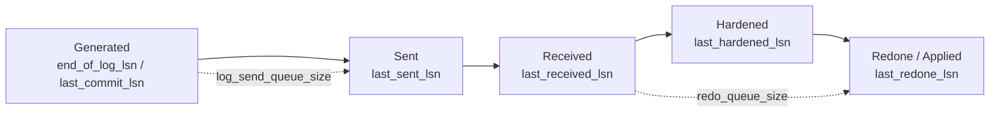

# Functional Specification 02 (Draft / Next Iteration): Availability Group Log-Flow & Lag Analysis

> **Status:** Idea backlog for a future iteration — **not scheduled in the MVP** (spec01 / plan01).
> This document captures the concept, a feasibility assessment (researched against Microsoft docs), and open questions. It is deliberately lighter than spec01 and must go through the normal brainstorm → spec → plan flow before implementation.

---

## 1. Idea

Extend **SqlLogExplorer** with a view that analyzes, for a SQL Server **Always On Availability Group (AG)**, *what has been sent to the secondaries* and *what is lagging* — i.e. the transaction-log replication pipeline and its data-loss / recovery-time exposure.

This is a natural conceptual extension of the tool: the MVP already reasons in terms of **LSNs and log records** (spec01 §4.1, §5). AG replication is literally *the same transaction log* flowing primary → secondary, measured at each stage in LSN terms. The tool would visualize that flow.

---

## 2. Feasibility — verdict: **HIGH**

The MVP's hardest parts (undocumented `fn_dblog`/`fn_dump_dblog`, disposable LocalDB/Docker instances, binary row decoding) are **not needed here**. AG state is exposed by **documented Dynamic Management Views** and is read with plain `SELECT`s over the existing live connection (spec01 §3.1, Path A).

* **Reuses existing infrastructure:** the Live Database connection path already built in the MVP.
* **No offline/backup handling, no binary decoding, no temp SQL instance.**
* **Permissions:** `VIEW SERVER STATE` (server DMVs) — lighter than the `sysadmin`/`fn_dblog` requirements of the MVP.
* **Applicability:** only meaningful when the connected instance participates in an AG. The UI must detect this (query `sys.availability_groups`) and gracefully hide/disable the feature otherwise.

### 2.1 Key source DMVs / catalog views (documented)

| View | Role |
| :--- | :--- |
| `sys.availability_groups` / `sys.availability_replicas` | AG and replica topology, availability mode (sync/async), failover mode. |
| `sys.dm_hadr_availability_replica_states` | Per-replica role (`PRIMARY`/`SECONDARY`), operational & connected state. |
| `sys.dm_hadr_database_replica_states` | **Core view** — per-database, per-replica LSN progress, queues, rates, lag. |
| `sys.dm_hadr_database_replica_cluster_states` | `is_failover_ready`, database join state. |
| `sys.availability_databases_cluster` | Database-name mapping across the WSFC cluster. |

### 2.2 Core metrics (from `sys.dm_hadr_database_replica_states`)

| Column | Meaning | Used for |
| :--- | :--- | :--- |
| `log_send_queue_size` (KB) | Primary log **not yet sent** to a secondary. | **Potential data loss** (RPO in bytes) on catastrophic primary loss. |
| `log_send_rate` (KB/s) | Average send throughput. | Estimated time to catch up sending. |
| `redo_queue_size` (KB) | Received but **not yet redone/applied** on the secondary. | **RTO** component (time to make secondary usable). |
| `redo_rate` (KB/s) | Average redo throughput on the secondary. | Estimated redo time. |
| `secondary_lag_seconds` | Seconds the secondary is behind (SQL 2016+). | Direct lag readout. |
| `last_commit_time` (primary vs secondary) | Last committed txn time on each side. | **RPO in seconds** = primary − secondary gap. |
| `synchronization_state_desc`, `synchronization_health_desc`, `suspend_reason_desc` | Sync/health/suspend status. | Diagnosis; guards derived math. |

### 2.3 The log-flow pipeline (LSN stages)

The AG pipeline maps directly onto LSN columns of the same DMV — this is the "what is sent vs. what is lagging" the feature is about:

* **Send gap** (generated → sent): `log_send_queue_size` → data at risk of loss.
* **Redo gap** (received → redone): `redo_queue_size` → data present on secondary but not yet queryable / not reducing RTO.

### 2.4 Derived KPIs (computed in the app)

* **Estimated time to synchronize (send):** `log_send_queue_size / log_send_rate`.
* **Estimated redo/recovery time (RTO component):** `redo_queue_size / redo_rate`.
* **RPO (data-loss window):** `primary.last_commit_time − secondary.last_commit_time` (cross-check with `secondary_lag_seconds`).

> **Pitfalls to encode:** when data movement is **suspended**, `secondary_lag_seconds` reports `0` and queues stop draining — derived values are misleading unless `synchronization_state_desc` / `suspend_reason_desc` are checked first. Rates are "last active period" averages, so a division can yield 0/∞; clamp and label as estimates. `*_lsn` columns are log-block IDs padded with zeroes, **not** true LSNs — do not compare them to `fn_dblog` LSNs directly.

---

## 3. Usefulness — verdict: **HIGH, with a clear differentiator**

For a DBA this answers the daily questions: *Is my secondary keeping up? If the primary dies now, how much do I lose (RPO)? How long until the secondary is usable (RTO)? Is the bottleneck the network (send queue) or the secondary CPU/IO (redo queue)?*

**Overlap:** SSMS already has an Always On dashboard with these columns, and the RPO/RTO estimation formulas. A plain re-implementation adds little.

**Differentiator (the reason to build it here):** SqlLogExplorer *also* reads the live transaction log via `fn_dblog`. It can **correlate lag with the actual log activity driving it** — e.g. "the redo queue is 4 GB *and* here is the `LOP_MODIFY_ROW` storm on `dbo.BigTable` (spec01 §4.3 quantification) generating that log volume." Tying **queue/lag** to **which objects and operations produce the log** is something the SSMS dashboard does **not** do, and it reuses the MVP's quantification engine directly. That correlation is the feature's unique value.

### 3.1 Characterizing *what* is in the queue — feasible (researched)

The DMVs report queue **size** (KB), not **content**. The content can be reconstructed by intersecting the queue's LSN boundaries with `fn_dblog`, then aggregating with the MVP quantification engine. This answers questions like *"is the send queue a big index rebuild, or a bulk load of one table?"*

**Why it works:**
1. **`fn_dblog` accepts a start/end LSN range.** Its two parameters are `@start`/`@end` LSNs (spec01 §3.4 passes `NULL, NULL` for the full log). Bounding the read to the queue's LSN window keeps it efficient instead of scanning the whole active log.
2. **Send-queue records are still in the primary's active log.** Log truncation is held back until the log is hardened on the secondaries, so the not-yet-sent records remain visible to `fn_dblog` **on the primary**.
3. **The numeric DMV LSN ↔ `fn_dblog` colon-format LSN conversion is a known, solved problem** (e.g. `4242000000012300002` → `4242:123:2`, via `CONVERT`/`STUFF` string math).

**Method:**
* **Send queue:** on the **primary**, take the range `[secondary.last_received_lsn (or last_hardened_lsn) → primary.end_of_log_lsn]`, convert to `fn_dblog` format, run `fn_dblog(@start, @end)`, and group by `Operation` + `AllocUnitName` (spec01 §4.3). Output: e.g. "92% of the send queue is operations on `IX_Orders_Date`" → **index rebuild**; or "`LOP_INSERT_ROWS` storm on `dbo.Facts`" → **bulk load**.
* **Redo queue:** the same idea over `[secondary.last_redone_lsn → secondary.last_hardened_lsn]`, but the records live on the **secondary**, so it requires `fn_dblog` on a secondary replica.

**Limits (must be stated in the UI):**
* The tool **infers intent** (rebuild vs. bulk load) from the log-record signature (operation mix + allocation unit + volume). It does **not** recover the originating T-SQL statement text — DDL like `ALTER INDEX ... REBUILD` is logged as low-level page/row operations, not as a statement.
* Correlation is at **log-block granularity** (the DMV `*_lsn` columns are block IDs with the slot padded to `0000`).
* `fn_dblog` is a **point-in-time snapshot**; the queue moves between reads.
* Even bounded by LSN range, a multi-GB queue is still a large read — cap/sample and disclose (spec01 style: never silently truncate).
* **Redo-queue content needs a spike:** running `fn_dblog` on a (readable) secondary replica — feasibility, permissions, and behavior on a non-readable secondary are unverified.

---

## 4. UX sketch (to be refined)

* A dedicated **"Availability Group" tab**, enabled only when the connected instance is in an AG.
* Topology header: AG name, replicas, roles, availability mode, health.
* Per secondary-database row: send queue, redo queue, `secondary_lag_seconds`, estimated sync time, estimated redo time, RPO seconds, health/suspend badges.
* The **log-flow pipeline** (§2.3) as a visual with the two gaps highlighted.
* **Interaction model differs from the MVP:** AG state is point-in-time. This view **polls** the DMVs on an interval (configurable, e.g. 5–30 s) and shows trend sparklines — unlike the MVP's one-shot blocking import. This is a deliberate architectural difference to design for.
* Optional **correlation panel**: link a lagging database to a quantification snapshot (§3) of its recent log activity.

---

## 5. Open questions (resolve during brainstorming before planning)

1. **Scope of the first cut:** read-only monitoring only, or also actions (resume/suspend data movement)? *(Actions add risk and privilege requirements — likely a later step.)*
2. **Polling vs. snapshot:** live polling dashboard (new interaction model) or a single on-demand snapshot to stay closer to the MVP shape?
3. **Where to run:** must connect to the **primary** for the full picture (secondary rows carry send/redo data on the primary); how to handle being connected to a secondary or to a listener?
4. **Version floor:** `secondary_lag_seconds` requires SQL Server 2016+. Minimum supported version? Fallback when absent (compute lag from `last_commit_time`).
5. **Correlation depth:** how tightly to couple the AG view with the fn_dblog quantification engine (the differentiator) vs. shipping a pure DMV dashboard first. A staged approach is likely: (a) pure DMV dashboard, then (b) send-queue content characterization on the primary (§3.1), then (c) redo-queue content on the secondary.
6. **Azure SQL DB / Managed Instance:** `sys.dm_database_replica_states` differs; in scope or not?
7. **Queue-content spikes (§3.1) to validate before planning:** (a) LSN conversion numeric ↔ `fn_dblog` format across SQL versions and its block-level precision; (b) running `fn_dblog` on a readable / non-readable secondary for redo-queue content; (c) cost of a range-bounded `fn_dblog` on a large (multi-GB) queue and the sampling/cap strategy.

---

## 6. Explicitly out of scope for this document

* Implementation details, data model, and task breakdown (belong in a future `plan02.md`).
* Any change to the spec01 MVP scope.
* Failover orchestration, alerting/notification, historical persistence of AG metrics beyond in-session trend.

---

## 7. Sources

* [Monitor performance for Always On availability groups (RTO/RPO estimation)](https://learn.microsoft.com/sql/database-engine/availability-groups/windows/monitor-performance-for-always-on-availability-groups)
* [sys.dm_hadr_database_replica_states (Transact-SQL)](https://learn.microsoft.com/sql/relational-databases/system-dynamic-management-views/sys-dm-hadr-database-replica-states-transact-sql)
* [Troubleshooting log send queueing in an Always On availability group](https://learn.microsoft.com/troubleshoot/sql/database-engine/availability-groups/troubleshooting-log-send-queuing-in-alwayson-availability-group)
* [Troubleshooting recovery (redo) queueing in an Always On availability group](https://learn.microsoft.com/troubleshoot/sql/database-engine/availability-groups/troubleshooting-recovery-queuing-in-alwayson-availability-group)
* [DMVs and system catalog views (Always On Availability Groups)](https://learn.microsoft.com/sql/database-engine/availability-groups/windows/dynamic-management-views-and-system-catalog-views-always-on-availability-groups)
* [Formatting binary(10) LSN values for use in sys.fn_dblog() — Michael J. Swart](https://michaeljswart.com/2022/08/formatting-binary10-lsn-values-for-use-in-sys-fn_dblog/) (numeric ↔ colon LSN conversion)
* [Using fn_dblog, fn_dump_dblog, and STOPBEFOREMARK — Paul S. Randal](https://www.sqlskills.com/blogs/paul/using-fn_dblog-fn_dump_dblog-and-restoring-with-stopbeforemark-to-an-lsn/) (fn_dblog start/end LSN)
